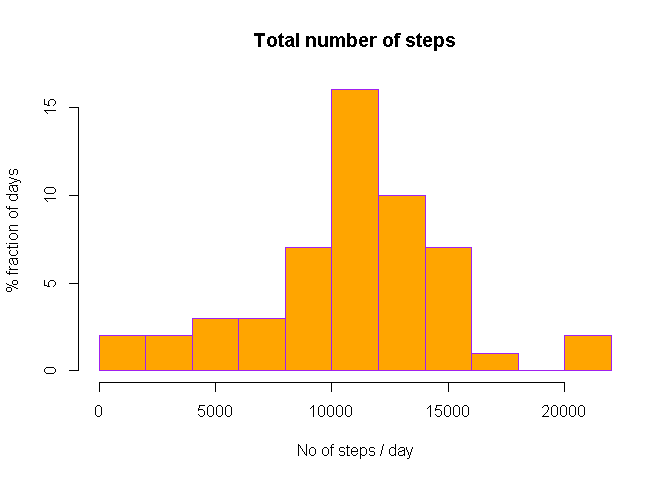
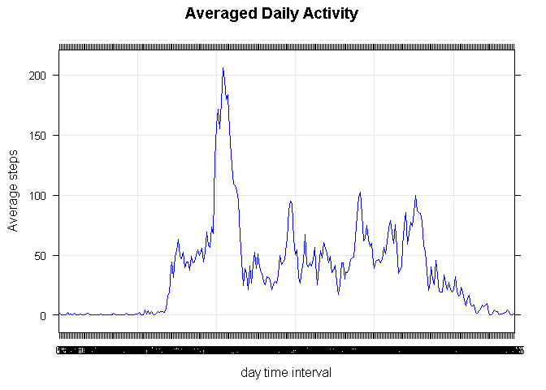
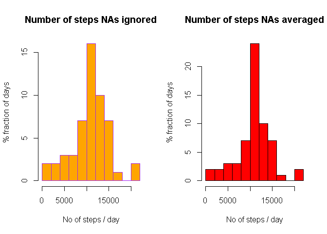
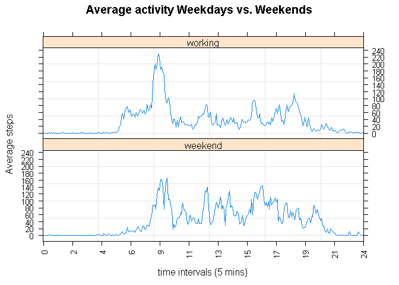

# Reproducible Research: Peer Assessment 1

## Loading and preprocessing the data
### default options

```r
Sys.setlocale("LC_TIME", "English")
```

```
## [1] "English_United States.1252"
```
### read the dataset

```r
wd<-getwd()
fn<-paste(wd,"/activity.csv",sep = "")
dset <- read.csv(fn, header = TRUE,stringsAsFactors=FALSE)
```
### exam the structure

```r
str(dset)
```

```
## 'data.frame':	17568 obs. of  3 variables:
##  $ steps   : int  NA NA NA NA NA NA NA NA NA NA ...
##  $ date    : chr  "2012-10-01" "2012-10-01" "2012-10-01" "2012-10-01" ...
##  $ interval: int  0 5 10 15 20 25 30 35 40 45 ...
```

```r
head(dset,n = 10)
```

```
##    steps       date interval
## 1     NA 2012-10-01        0
## 2     NA 2012-10-01        5
## 3     NA 2012-10-01       10
## 4     NA 2012-10-01       15
## 5     NA 2012-10-01       20
## 6     NA 2012-10-01       25
## 7     NA 2012-10-01       30
## 8     NA 2012-10-01       35
## 9     NA 2012-10-01       40
## 10    NA 2012-10-01       45
```

```r
tail(dset,n = 10)
```

```
##       steps       date interval
## 17559    NA 2012-11-30     2310
## 17560    NA 2012-11-30     2315
## 17561    NA 2012-11-30     2320
## 17562    NA 2012-11-30     2325
## 17563    NA 2012-11-30     2330
## 17564    NA 2012-11-30     2335
## 17565    NA 2012-11-30     2340
## 17566    NA 2012-11-30     2345
## 17567    NA 2012-11-30     2350
## 17568    NA 2012-11-30     2355
```
### transforming the variables
### convert dates to proper type

```r
dset$date<-as.Date(dset$date)
```
### format intervals, extract hours and minutes

```r
ival<-formatC(dset$interval,digits = 0,width = 4,flag = "0000")
dset$hour<-substr(ival,start = 1,stop = 2)
dset$mins<-substr(ival,start = 3,stop = 4)
```

## What is mean total number of steps taken per day?

### 1. Make a histogram of the total number of steps taken each day
### Compute the column and plot the histogram

```r
stepspday <- aggregate(steps ~ date, data=dset, FUN="sum", na.exclude=TRUE)
hist(stepspday$steps,breaks = 12,
     xlab = "No of steps / day",
     ylab = "% fraction of days",
     main = "Total number of steps",
     col = "orange",border = "purple"
     )
```

 

### 2. Calculate and report the mean and median total number of steps taken per day

```r
mean(stepspday$steps, na.rm=TRUE)
```

```
## [1] 10767.19
```

```r
median(stepspday$steps, na.rm=TRUE)
```

```
## [1] 10766
```


## What is the average daily activity pattern?

### 1. Make a time series plot (i.e. type = "l") of the 
### 5-minute interval (x-axis) and the average number of steps taken,
### averaged across all days (y-axis)

```r
dset$interval<-as.factor(dset$interval)
meanspinterval <- aggregate(steps ~ interval, data=dset, FUN="mean", na.exclude=TRUE)
library(lattice)
xyplot(steps ~ interval, data=meanspinterval,col = "blue",
       type="l", grid=TRUE, xlab="day time interval", 
       ylab="Average steps",main="Averaged Daily Activity",)
```

 

### 2. Which 5-minute interval, on average across all the days 
### in the dataset, contains the maximum number of steps?

```r
maxed <- meanspinterval$interval[which.max(meanspinterval$steps)]
maxed<-formatC(as.integer(as.character(maxed)),digits=0,width = 4,flag = "0")
repmax<-paste("Average daily activity is maximized at ",substr(maxed,1,2)," hours and ", substr(maxed,3,4)," minutes",sep="")
repmax
```

```
## [1] "Average daily activity is maximized at 08 hours and 35 minutes"
```


## Imputing missing values

### 1. Calculate and report the total number of missing values in the dataset 
###  (i.e. the total number of rows with NAs)

```r
NAs <- sum(is.na(dset$steps))
NAs
```

```
## [1] 2304
```

### 2. Devise a strategy for filling in all of the missing values in 
### the dataset. The strategy does not need to be sophisticated. 
### For example, you could use the mean/median for that day, 
### or the mean for that 5-minute interval, etc.
### _I will use the step means per interval already stored..._ 

```r
str(meanspinterval)
```

```
## 'data.frame':	288 obs. of  2 variables:
##  $ interval: Factor w/ 288 levels "0","5","10","15",..: 1 2 3 4 5 6 7 8 9 10 ...
##  $ steps   : num  1.717 0.3396 0.1321 0.1509 0.0755 ...
```

### 3. Create a new dataset that is equal to the original dataset but with the missing data filled in.
### make copy

```r
dsetfill<-dset
```

### index of the NAs

```r
idx<-which(is.na(dset$steps))
```

### substitute NAs with mean interval values

```r
dsetfill$steps[idx]<-meanspinterval$steps[dset$interval[idx]]
```

### 4. Make a histogram of the total number of steps taken each day
### and Calculate and report the mean and median total number of steps 
### taken per day. Do these values differ from the estimates from the 
### first part of the assignment? 
### What is the impact of imputing missing data on the estimates 
### of the total daily number of steps?

```r
fstepspday <- aggregate(steps ~ date, data=dsetfill, FUN="sum", na.exclude=TRUE)
par(mfrow=c(1,2))
hist(stepspday$steps,breaks = 12,
     xlab = "No of steps / day",
     ylab = "% fraction of days",
     main = "Number of steps NAs ignored",
     col = "orange",border = "purple"
)
hist(fstepspday$steps,breaks = 12,
     xlab = "No of steps / day",
     ylab = "% fraction of days",
     main = "Number of steps NAs averaged",
     col = "red",border = "black"
)
```

 

# mean and median with NA adjustment

```r
mean(fstepspday$steps, na.rm=TRUE)
```

```
## [1] 10767.19
```

```r
median(fstepspday$steps, na.rm=TRUE)
```

```
## [1] 10767.19
```

# original mean and median 

```r
mean(stepspday$steps, na.rm=TRUE)
```

```
## [1] 10767.19
```

```r
median(stepspday$steps, na.rm=TRUE)
```

```
## [1] 10766
```

### assessment
- means remain identical from the NAs imputation
- medians differs slightly
- Shapes of distributions does not differentiate 
- the volume of steps increases as result of NAs imputation

## Are there differences in activity patterns between weekdays and weekends?

### 1. Create a new factor variable in the dataset with 
### two levels -- "weekday" and "weekend" indicating whether a given date 
### is a weekday or weekend day.

```r
dsetfill$day <- "working"
dsetfill$day[weekdays(as.Date(dsetfill$date),abb=TRUE) %in% c("Sat","Sun")] <- "weekend"
table(dsetfill$day)
```

```
## 
## weekend working 
##    4608   12960
```

### 2. Make a panel plot containing a time series plot (i.e. type = "l")
### of the 5-minute interval (x-axis) and the average number of steps 
### taken, averaged across all weekday days or weekend days (y-axis). 

```r
meanspday <- aggregate(steps ~ interval + day, data=dsetfill, FUN="mean")
x.tick.number <- 23
at <- seq(1, nrow(meanspday), length.out=x.tick.number)
labels <- round(seq(0, 47, length.out=x.tick.number))
xyplot(steps ~ interval | day, data=meanspday, type="l", grid=T, layout=c(1,2),
       scales=list(y=list(tick.number=10), x=list(at=at, labels=labels, rot=90)),
       ylab="Average steps", xlab="time intervals (5 mins)", 
       main="Average activity Weekdays vs. Weekends")
```

 

### _May the R be with you..._


